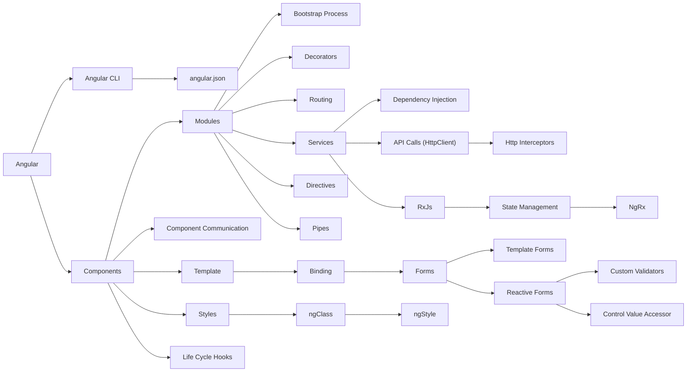

# Angular

Angular is an application-design framework and development platform for creating efficient and sophisticated single-page apps.

## Prerequisite

- Html, CSS, Javascript
- Classes, Functions, Modules
- Typescript, dependency injection, decorators

> Note
> If not familiar with Typescript, see typescript crash course [here](Typescript.md)

## Getting Started

With Node installed, to install a and create a angular project, use the following command -

```bash
$ npm install -g @angular/cli

$ npm init -y

$ ng new <project-name>
```

Then we need to install all dependencies.
```bash
$ npm install
```

Now you have a project with angular installed. Use the following command to run the project on `localhost:4200`.
```bash
$ ng serve -o
```

## Roadmap



Roadmap links
|   |   |   |   |
|---|---|---|---|
| [Angular](./Angular.md#Angular) | [AngularCLI](./AngularCLI.md#AngularCLI) | [AngularJson](./AngularJson.md#AngularJson) | [Binding](./Binding.md#Binding) | [Bootstrap](./Bootstrap.md#Bootstrap)
| [ComponentCommunication](./ComponentCommunication.md#ComponentCommunication) | [Components](./Components.md#Components) | [ControlValueAccessor](./ControlValueAccessor.md#ControlValueAccessor) | [CustomValidators](./CustomValidators.md#CustomValidators)
| [Decorators](./Decorators.md#Decorators) | [DependencyInjection](./DependencyInjection.md#DependencyInjection) | [Directives](./Directives.md#Directives) | [Forms](./Forms.md#Forms)
| [HttpClient](./HttpClient.md#HttpClient) | [HttpInterceptors](./HttpInterceptors.md#HttpInterceptors) | [LifeCycleHooks](./LifeCycleHooks.md#LifeCycleHooks) | [Modules](./Modules.md#Modules)
| [ngClass](./ngClass.md#ngClass) | [NgRx](./NgRx.md#NgRx) | [ngStyle](./ngStyle.md#ngStyle) | [Pipes](./Pipes.md#Pipes)
| [ReactiveForms](./ReactiveForms.md#ReactiveForms) | [Routing](./Routing.md#Routing) | [RxJs](./RxJs.md#RxJs) | [Services](./Services.md#Services)
| [StateManagement](./StateManagement.md#StateManagement) | [Styles](./Styles.md#Styles) | [Template](./Template.md#Template) | [TemplateForms](./TemplateForms.md#TemplateForms)

## Directory Structure

An Angular project's folder structure can change based on the project's size and complexity, but it often follows a consistent pattern. An Angular project's basic folder structure consists of the following main folders:

- `node_modules` -> This folder is created when you run npm install, and it contains all of the project's dependencies.
- `src` -> This is the main folder for the application's source code.
- `.angular-cli.json` -> This file contains configurations for the Angular CLI.
- `package.json` -> This file contains the project's dependencies, scripts, and other metadata.
- `tsconfig.json` -> This file contains the TypeScript compiler configurations for the application.
- `angular.json` -> This file contains the angular project configurations for the application.
- `.gitignore` -> This file contains the configuration for git, which files to ignore.
- `.editorconfig` -> This file contains the configuration for editor and code format.
- `src/app` -> This folder contains the actual code for the application, including the components, services, pipes, and other code.
- `src/app/components` -> This folder contains all the components of the application.
- `src/app/services` -> This folder contains all the services of the application.
- `src/app/models` -> This folder contains all the data models of the application.
- `src/assets` -> This folder contains all the assets of the application such as images, fonts and etc.
- `src/environments` -> This folder contains the environment-specific settings of the application such as api endpoint etc.
- `src/styles` -> This folder contains all the global css and scss files of the application.

# Next Steps
[<-- Typescript](Typescript.md#typescript) | [Components -->](./Component.md#angular-components)

- [Bootstrap](Bootstrap.md#angular-bootstrap)
- [Angular CLI](Angular-CLI.md#angular-cli)
