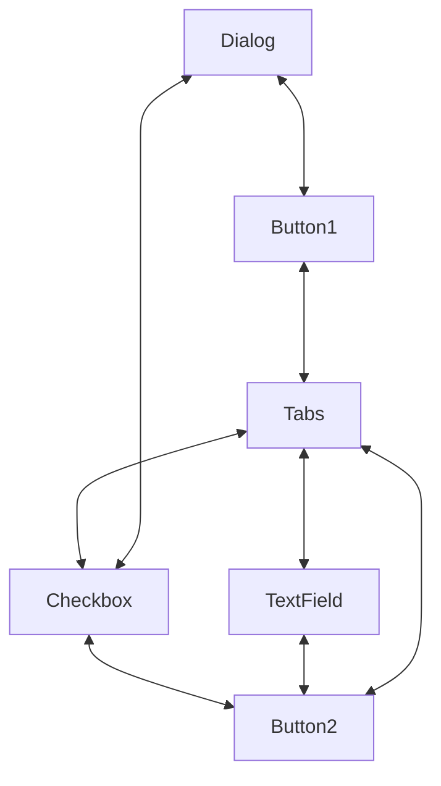
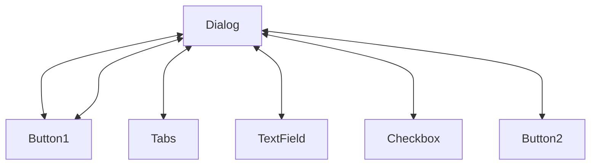

# CQRS & MediatR

CQRS stands for Command and Query Responsibility Segregation, a pattern that separates read and update operations for a data store.

## Advantages of CQRS

- **Independent scaling**: CQRS allows the read and write seaparates operations. Which allows read and write workloads to scale independently, and may result in fewer lock conflicts.
- **Optimized data schemas**: The read side can use a schema that is optimized for queries, while the write side uses a schema that is optimized for updates.
- **Security**: It's easier to ensure that only the right domain entities are performing writes on the data.
- **Separation of concerns**: Segregating the read and write sides can result in models that are more maintainable and flexible. Most of the complex business logic goes into the write model. The read model can be relatively simple.
- **Simpler queries**: In the isolated read data-store we can store materialized view to avoid complex joins when querying & faster results.

> Materialized Views
> 
> A materialized view is a duplicate data table created by combining data from multiple existing tables for faster data retrieval.

## Disadvantages of CQRS

- **Complexity**: Read & Write data stores and access can be completely independent, from schemas to application & domain logic.

- **Eventual consistency**: If you separate the read and write databases, the read data may be stale. The read model store must be updated to reflect changes to the write model store, and it can be difficult to detect when a user has issued a request based on stale read data.

## When to use CQRS

- Collaborative domains where many users access the same data in parallel. CQRS allows you to define commands with enough granularity to minimize merge conflicts at the domain level, and conflicts that do arise can be merged by the command.
- Task-based user interfaces where users are guided through a complex process as a series of steps or with complex domain models. The write model has a full command-processing stack with business logic, input validation, and business validation. The write model may treat a set of associated objects as a single unit for data changes (an aggregate, in DDD terminology) and ensure that these objects are always in a consistent state. The read model has no business logic or validation stack, and just returns a DTO for use in a view model. The read model is eventually consistent with the write model.
- Scenarios where performance of data reads must be fine-tuned separately from performance of data writes, especially when the number of reads is much greater than the number of writes. In this scenario, you can scale out the read model, but run the write model on just a few instances. A small number of write model instances also helps to minimize the occurrence of merge conflicts.
- Scenarios where one team of developers can focus on the complex domain model that is part of the write model, and another team can focus on the read model and the user interfaces.
- Scenarios where the system is expected to evolve over time and might contain multiple versions of the model, or where business rules change regularly.
- Integration with other systems, especially in combination with event sourcing, where the temporal failure of one subsystem shouldn't affect the availability of the others.

## Example of CQRS (TODO)

# MediatR

Mediator is a behavioral design pattern that lets you reduce chaotic dependencies between objects. The pattern restricts direct communications between the objects and forces them to collaborate only via a mediator object.

