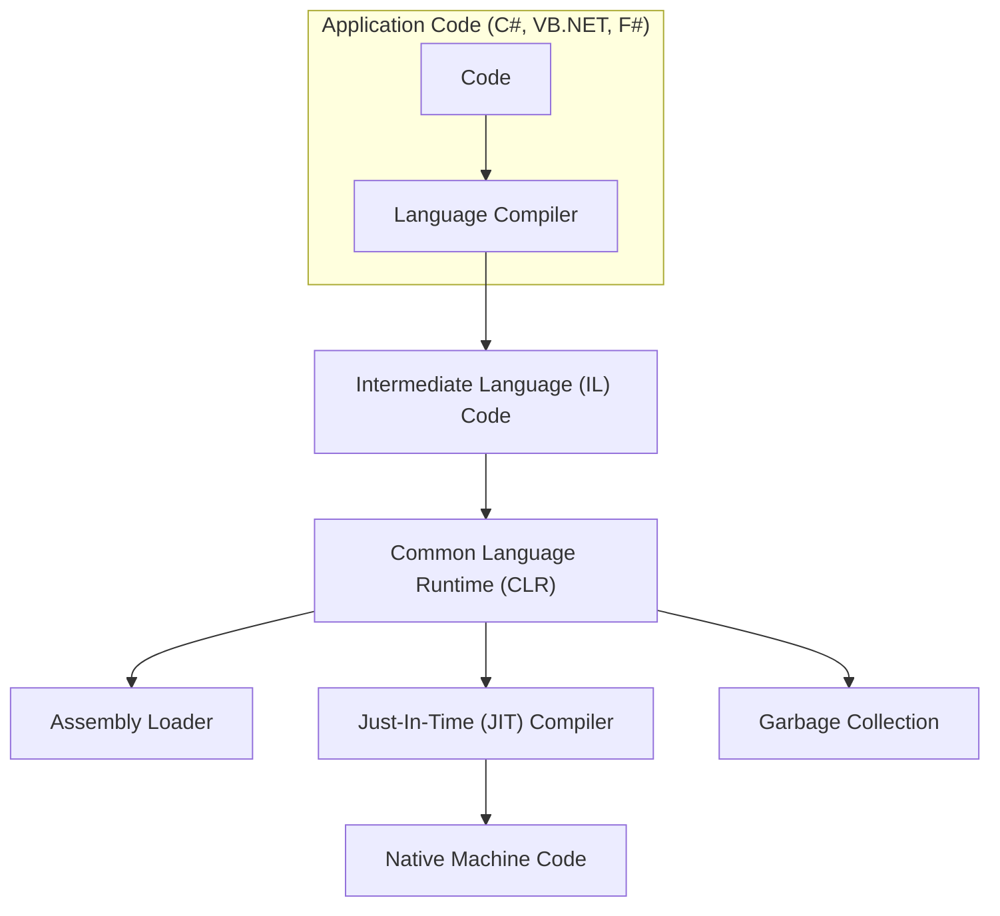

# .NET

.NET is a free and open-source application platform supported by Microsoft. It provides cross platform support for Windows, Mac, Linux and even Android. It is comes with a C#, a popular, strongly-typed object-oriented language that has integrated concurrency and memory management.

## .NET Core VS .NET Framework

.NET core was introduced in 2016

| .Net Framework                                                           | .Net Core                                                                                                                              |
|--------------------------------------------------------------------------|----------------------------------------------------------------------------------------------------------------------------------------|
| Allows developers to create application for windows and on windows only. | Supports cross platform development, allows developers to develop on any platform i.e. windows, mac, linux. And also ship to the same. |

## Components of .NET
- **CLR**: Common Language Runtime is a run-time environment provided within .NET. CLR provides an execution engine that runs the JIT-compiler and handles various runtime tasks, such as method invocations and exception handling and memory management.
- **CLS**: Common Language Specification defines a set of base rules and standards that .NET languages must adhere to in order to be compatible with one another. This ensures that code written in one .NET language can interact seamlessly with code written in another .NET language. The CLS is a subset of the Common Type System (CTS), which defines all possible data types and programming constructs supported by the CLR.
- **IL**: Intermediate Language is a language between native code and actual source code. During .NET execution flow when the actual source code written in high level languages like C#, F#, VB,... is converted into IL and then processed by the JIT compiler into native code.
- **JIT**: Just In Time is a compiler that converts IL code into native code. It compiles IL code on the fly to machine-specific instructions that A CPU can execute. JIT is also performs performance optimizations.
- **BCL**: Base Class Library, is a module/library as its name suggests. It is holds implementation and structure of common and useful APIs like `System`, `Threading`, `Collections`, `IO`, ...

## Execution flow in .NET

As displayed in the diagram below,
1. The source code you write is converted to Intermediate Language (IL) using Language compiler. That is assembly files (.dll) and executable files (.exe).
1. When you run your application the Common Language Runtime (CLR) compiles IL code to native machine code.
1. The compilation to native machine code is done by the Just In Time (JIT) compiler.
1. Native machine code is executed.
1. After execution of code CLR also takes care of garbage collecting unused memory.

Execution Flow Diagram

## .NET Assembly

In .NET an Assembly is a packaged unit of compiled code, resources and metadata.

Types of Assemblies
- **Single-File Assembly**: Contains all the necessary code and resources in a single executable or dynamic link library (DLL) file.
- **Multi-File Assembly**: Consists of multiple files, usually a main DLL file and associated satellite assemblies containing localized resources.
- **Executable (EXE) Assembly**: Produces an executable file that can be run directly.
- **Library (DLL) Assembly**: Produces a dynamic link library file that can be referenced and used by other assemblies.

## Managed & Un-Managed Code

- **Managed Code**: Managed code refers to code that runs within the Common Language Runtime (CLR) environment in .NET. Managed code benefits from features such as automatic memory management (garbage collection), type safety, and exception handling provided by the CLR.
- **Un-managed Code**: Un-managed code, on the other hand, refers to code that runs outside the control and management of the CLR. Un-managed code is responsible for managing its own memory and resource allocation.
