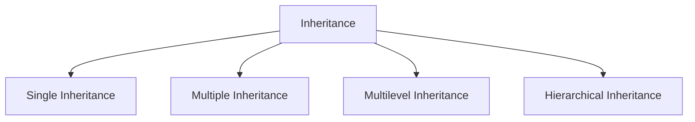

# Object Oriented Programming Concepts

Object-Oriented Programming or OOPs refers is a thinking pattern to solve programming problems often used along side languages that support OOPs. OOPs aims to implement real-world entities like inheritance, hiding, polymorphism, etc in programming. The main aim of OOP is to bind together the data and the functions that operate on them so that no other part of the code can access this data except that function.

## Abstraction

Abstraction is to hide internal details such that to make it simpler.

For example: For the user of a car, the user only needs to know how to drive the car hence we only expose the necessary information to the user. We don't expose the interal working of the car, how the car works to the user as it is unnecessary.

## Encapsulation

Encapsulation is the wrapping up of data and information in a single unit. The simplest and easiest example would be a `class`. A class can hold both data and behaviour.

## Inheritance

Inheritance is a concept of Object Oriented Programming that allows a class to inherit/extend another classes properties and behaviors. Inheritance can also be thought of as generalization or specialization when going from bottom to top or visa versa.

There are 4 types of inheritance:

- Single Inheritance: 1 base class is inherited by 1 derived class.
- Multiple Inheritance: 1 derived class is inherited from multiple base classes.
- Multilevel Inheritance: base class to derived class change of multiple single inheritance.
- Hierarchical Inheritance: 1 base class is inherited by multiple derived classes.

## Ploymorphism

Polymorphism by definition means to have multiple forms. In a programming context it means to have different behaviors. Polymorphism is implemented in 2 ways Overloading and Overriding.
- **Overloading** is when you have 2 functions with same name but different signatures (number of arguments, type of those arguments). Also know as compile-time polymorphism.
- **Overriding** when a child class overwrites or extends the parent classes existing behavior. Same name and signature but internally different logic. Also know as run-time polymorphism.

## Classes VS Interfaces VS Abstract Classes (TODO)

## Access Modifiers

Access modifiers defines the level of access to object. There are 4 access modifiers in C#/any oop language.

- **Private**: Allowed access to only within the defined class.
- **Public**: Allowed access inside and outside the defined class.
- **Protected**: Allowed access to only inheriting child classes.
- **Static**: Static members are rather bound to the class than the instance of the class. globally accessible to all instances.
