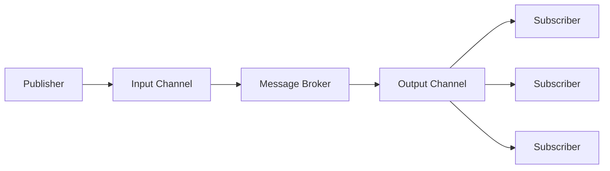

# Rabbit MQ

RabbitMQ is a message broker platform. Its job is to pass a message to the correct consumers.

RabbitMQ works on a Pub/Sub model. The Publisher & Subscriber model is a way to implement asynchronous communication. Asynchronous communication means that both participants the sender a receiver of the message arn't required to be online at the time of communication. A side effect of asynchronous communication is decoupling of senders and receivers.




## Actors

- `Producers`: Producers are the actors that create messages that need to delivered. 
- `Consumers`: Consumers are the actors that process the messages that are delivered to them.
- `Message Broker`: Message Broker are the middle man that pass the message from a producers to the appropriate consumers.


## Exchange

In RabbitMQ Exchanges are the core part of the asynchronous communication, playing the roles of router that pass the message to the right queue.

There are 3 types of Exchanges:

- `Direct`: A direct exchange delivers messages to queues based on a message routing key. The routing key is a message attribute added to the message header by the producer.

```mermaid
---
title: Direct Exchange Example.
---
graph LR
    Producer1 --> Exchange1[Direct Exchange]
    Exchange1[Direct Exchange] --key:login---> Queue1
    Exchange1[Direct Exchange] --key:payment---> Queue2
    Exchange1[Direct Exchange] --key:purchase---> Queue3
````

- `Fanout`: A fanout exchange copies and routes a received message to all queues that are bound to it regardless of routing keys or pattern matching as with direct and topic exchanges. The keys provided will simply be ignored.

```mermaid
---
title: Fanout Exchange Example.
---
graph LR
    Producer1 --> Exchange1[Fanout Exchange]
    Exchange1[Fanout Exchange] ----> Queue1
    Exchange1[Fanout Exchange] ----> Queue2
    Exchange1[Fanout Exchange] ----> Queue3
````


- `Topic`: Topic exchanges route messages to queues based on wildcard matches between the routing key and the routing pattern, which is specified by the queue binding. Messages are routed to one or many queues based on a matching between a message routing key and this pattern.

```mermaid
---
title: Topic Exchange Example.
---
graph LR
    Producer1 --> Exchange1[Topic Exchange]
    Exchange1[Topic Exchange] --key:#.login---> Queue1
    Exchange1[Topic Exchange] --key:user.*.payment---> Queue2
    Exchange1[Topic Exchange] ---> Queue3
```

The asterisk ("*") to match a word in a specific position of the routing key. For example, a routing pattern of `"user.*.payment"` only match routing keys that are 3 words long, the first word is "user" and third word is "payment".

A pound symbol ("#") indicates a match of zero or more words. For example, a routing pattern of `"#.login"` matches any routing keys ends with "login".

## Queues


## AMQP
