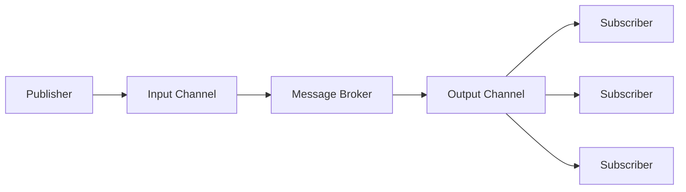

# Rabbit MQ

RabbitMQ is a message broker platform. Its job is to pass a message to the correct consumers.

RabbitMQ works on a Pub/Sub model. The Publisher & Subscriber model is a way to implement asynchronous communication. Asynchronous communication means that both participants the sender a receiver of the message arn't required to be online at the time of communication. A side effect of asynchronous communication is decoupling of senders and receivers.

## Actors

- `Producers`: Producers are the actors that create messages that need to delivered. 
- `Consumers`: Consumers are the actors that process the messages that are delivered to them.
- `Message Broker`: Message Broker are the middle man that pass the message from a producers to the appropriate consumers.

## Exchange

## Queues

## AMQP
