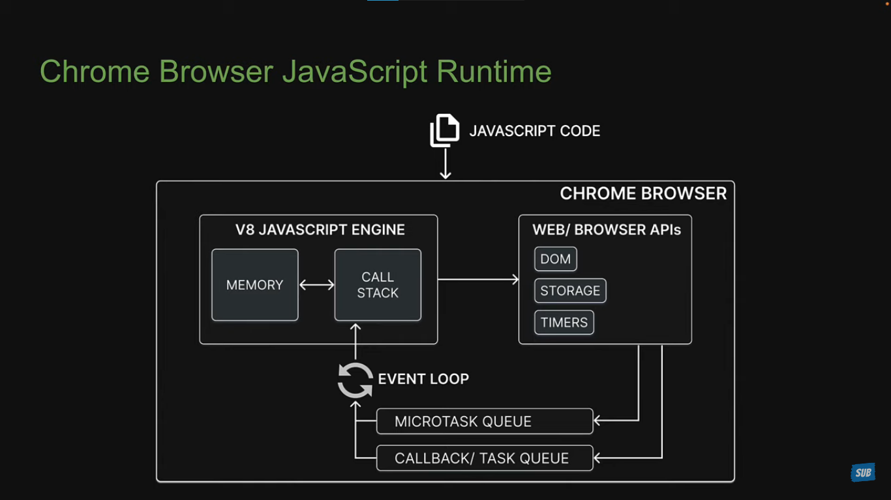
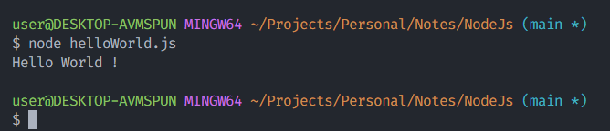

# Node Js

Node Js is a Javascript Runtime Environment.

## ECMA Script

Ecma Script is a Standard specification for scripting language that runs in the browser.

## Javascript Engine

Javascript Engine that converts javascript code to machine code.

- V8 engine is Chrome browser's Javascript Engine.
- SpiderMonkey is Firefox's Javascript Engine.
- JavaScript Core is Safari's Javascript Engine.
- Chakra is Internet Explorer's Javascript Engine.

### V8

V8 is Google's open source Javascript Engine. V8 can run standalone or be embedded into any C++ application. This enables you to write a program that can run javascript and additional features that you choose to incorporate.

## Javascript Runtime

Just a javascript engine is not enough; because Javascript as we know it is ECMA Script plus all the web Apis (DOM, LocalStorage, Timers, ...etc)

## Development Environment

Download Node Js from [Here](https://nodejs.org/en/download/). Install the LTS version.
Run the installation file and stick to defaults.

## Hello World

Command to check Node Version: `node -v`

Start interactive node REPL: `node`

> Note
>
> - **R**ead **E**valudate **P**rint **L**oop
> - To exit interactive REPL: `Ctrl + C`

Run a javascript file in node js: `node <file-path>`

> **Javascript in Node vs Browser**
>
> In Node we control the environment. We have access to filesystem and other apis provided by node, but we don't have access to the DOM.
> In Browser we do not control the environment and we have access to the DOM but we don't have access to apis provided by node.

😎 **Next Steps**
- [Modules](./Modules.md#modules)
- [ES Modules](./Modules.md#es-modules)
