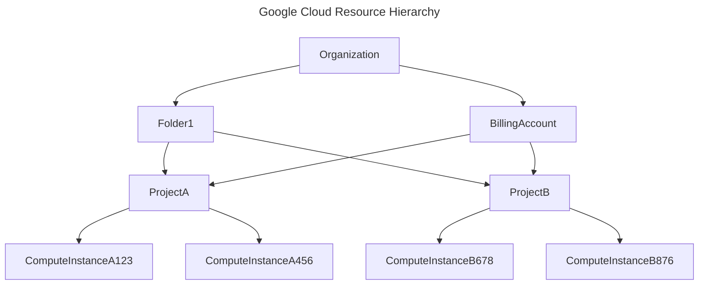

# Google Cloud Platform (GCP)

## What is GCP ?
Google Cloud Platform is a Google provided platform/service that allows it users to do cloud computing using Google's infrastructure.

Visit: [Google Cloud Console](https://console.cloud.google.com/welcome?hl=en&project=helpful-kingdom-474209-u8)


## Cloud Computing
Cloud Computing is the delivery of on-demand computing services (like servers, storage, networking, database, ...) over the public internet.


## Cloud Services
In cloud the services can be consumed in different way:
- **IAAS**: Infrastrucure As A Service
    e.g. Compute Engine (VM Instances)
- **CAAS**: Container As A Service
    e.g. Google Kubernetes Engine
- **PAAS**: Platform As A Service
    e.g. App Engine (Managed application service)
- **FAAS**: Function As A Service
    e.g. Cloud Functions, Cloud Run (Container Functions)
- **SAAS**: Software As A Service
    e.g. Gmail, Google Drive, etc...


## History Of Cloud Computing

- TODO: Before Cloud Computing
- TODO: After Cloud Computing


## Cloud Network
Google Cloud Network is divided in `Locations` > `Regions` > `Zones`.

- **Zones**: Smallest geographic point in Google's Network
- **Regions**: Collection of Specific Zones
- **Locations**: Collection of Specific Regions

The Locations/Regions/Zones are predefined and provided by Google. They state where your particular cloud resource will be hosted at.

To see the latest list of Google Cloud Network locations, click [here](https://cloud.google.com/about/locations)


## Cloud Resource Hierarchy
The Google Cloud Resource Hierarchy is a structured, tree-like model used to organize and manage resources and the access control to resources beneath it. Identity & Access Management ([IAM](./identity-access-management.md)) utilizes this resource hierarchy model to set polices which control who can access what on which resource.

A resource is service/account used in Google Cloud by the user. e.g. Compute Instance VM, Cloud Storage Bucket, Reserved IP, etc...
It is the actual cloud service or component that run your workload.



- `Organization`: Top-level node defining organization and the polices at org level.
    You can create a Organization Identity using the Cloud Identity Service in the Google Cloud Console.
- `Folders`: It is an optional grouping mechanism for projects. A folder can contain another folder or a project. It is used to apply polices to multiple projects at once.
- `Projects`: It is a fundamental organizational block that is linked to every single resource. Any and every resource is linked to exactly 1 project.
- `Resources`: Resources are the actual cloud services and components that run your workloads.


## Cloud Billing
- TODO: Cloud Billing (Components of Cloud Billing)
- TODO: Cloud Reports
- TODO: Ideal and Easy Cloud Billing Setup


## Accessing Google Cloud
There are multiple ways to access `Google Cloud Platform`. Namely Google Cloud Console, Google Cloud CLI, Google Cloud API (REST)

- **Google Cloud Console**: Google Cloud Console is a web based GUI that provides access to Google Cloud Services in a simple and easy to use manner.

    Visit: [Google Cloud Console](https://console.cloud.google.com/welcome?hl=en&project=helpful-kingdom-474209-u8)
- **Google Cloud SDK/CLI**: ...
- **Google Cloud REST Api/ApiClients**: Google Cloud provides REST APIs and API Clients to connect to google cloud to redeem cloud services. The ApiClients are available in multiple languages (Javascript, .Net, Python, Go,...).
- **Google Cloud App**: TODO: Accessing Google Cloud Services via Google Cloud App


## Google Cloud SDK/CLI
- TODO: Installing google cloud sdk.
- TODO: Google cloud CLI init


### Installing Google Cloud SDK


### Google Cloud CLI Init


### Google Cloud CLI Config
`gcloud config` allows you to create and manage cloud configs. Configs can be used to easily set set the current cloud project and account when using the SDK/CLI.

gcloud command structure:
```
$ gcloud <command> <subcommand> [list/describe/create/delete] [args...]
```

gcloud config hierarchy (from lowest to highest priority):
- central: applicable to all users in the same project
- local: applicable to current user on local machine
- command: applicable to current command

1. List all active properties in the current config
    ```
    $ gcloud config list
    ```
1. Create Config
    ```
    $ gcloud config configurations create ...
    ```
1. List Config
    ```
    $ gcloud config configurations list
    ```
1. Describe Config
    ```
    $ gcloud config configurations describe <config-name>
    ```
1. Activate Config
    ```
    $ gcloud config configurations activate <config-name>
    ```
1. Deactivate Config
    ```
    $ gcloud config configurations deactivate <config-name>
    ```
1. Delete Config
    ```
    $ gcloud config configurations delete <config-name>
    ```
1. Set Config Value
    ```
    $ glcoud config set <config-prop> <value>
    ```
    > Note: With config set `core` is the default section which is selected
1. unset Config
    ```
    $ glcoud config set <config-prop>
    ```

> Note: More gcloud cli commands - [gcloud cli docs](https://cloud.google.com/sdk/docs/cheatsheet)

